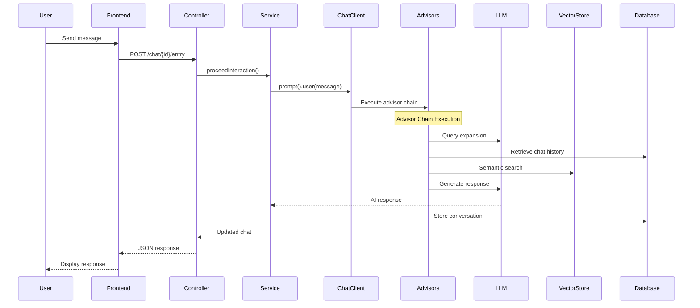
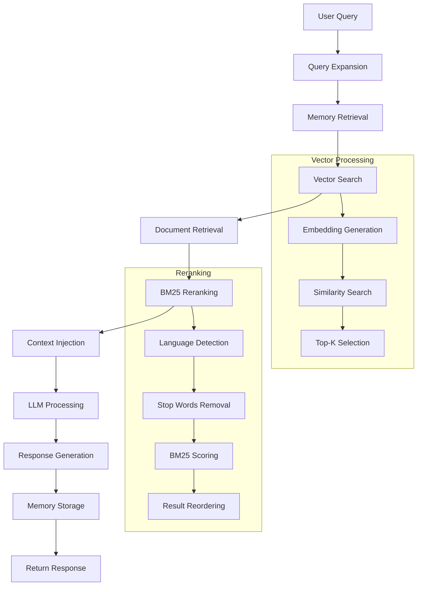

# Architecture Documentation

This document provides a comprehensive overview of the AI Chat Application architecture, including system design, component interactions, and data flow patterns.

## System Overview

The AI Chat Application is built using a layered architecture pattern with Spring Boot, integrating multiple AI components to provide intelligent conversation capabilities with retrieval-augmented generation (RAG) and persistent memory.

```
┌─────────────────┐    ┌─────────────────┐    ┌─────────────────┐
│   Web Frontend  │────│  REST API Layer │────│  Service Layer  │
└─────────────────┘    └─────────────────┘    └─────────────────┘
                                │                       │
                                │                       │
┌─────────────────┐    ┌─────────────────┐    ┌─────────────────┐
│    Ollama LLM   │────│   Spring AI     │────│  Data Layer     │
└─────────────────┘    └─────────────────┘    └─────────────────┘
                                │                       │
┌─────────────────┐    ┌─────────────────┐    ┌─────────────────┐
│  Vector Store   │────│  Advisor Chain  │────│   PostgreSQL    │
└─────────────────┘    └─────────────────┘    └─────────────────┘
```

## Core Components

### 1. Presentation Layer

#### Web Frontend
- **Location**: `src/main/resources/static/` and `src/main/resources/templates/`
- **Technologies**: HTML, CSS, JavaScript
- **Components**:
  - Chat interface (`chat.html`, `chat.css`, `chat.js`)
  - Login page (`login.html`, `login.css`)
- **Responsibilities**:
  - User interface rendering
  - Real-time chat interaction
  - API communication

#### REST Controllers
- **ChatController**: Main API endpoints for chat operations
- **HomeController**: Web page routing and authentication

### 2. Business Logic Layer

#### Services
- **ChatService**: Core business logic for chat management
  - Chat CRUD operations
  - AI interaction orchestration
  - Transaction management
- **DocumentLoaderService**: Knowledge base management
  - Document ingestion
  - Vector embeddings generation
  - Knowledge base updates
- **PostgresChatMemory**: Custom memory implementation
  - Conversation history persistence
  - Memory retrieval and storage
  - Message limit management

### 3. AI Processing Layer

#### Spring AI Integration
The application leverages Spring AI framework for LLM integration:

```java
@Bean
public ChatClient chatClient(ChatClient.Builder builder, VectorStore vectorStore) {
    return builder
        .defaultSystem(SYSTEM_PROMPT)
        .defaultOptions(chatOptions)
        .defaultAdvisors(advisorChain)
        .build();
}
```

#### Advisor Chain Pattern
The AI processing follows a chain of responsibility pattern with multiple advisors:

1. **SimpleLoggerAdvisor (Order 0)**
   - Request logging and monitoring
   - Performance tracking

2. **ExpansionQueryAdvisor (Order 1)**
   - Query expansion using LLM
   - Context enhancement
   - Improved retrieval accuracy

3. **MessageChatMemoryAdvisor (Order 2)**
   - Conversation history injection
   - Context continuity
   - Memory management

4. **SimpleLoggerAdvisor (Order 3)**
   - Intermediate logging
   - Debug information

5. **RagAdvisor (Order 4)**
   - Document retrieval
   - Semantic search
   - Context augmentation
   - BM25 reranking

6. **SimpleLoggerAdvisor (Order 5)**
   - Final request logging
   - Response preparation

### 4. Data Layer

#### JPA Repositories
- **ChatRepository**: Chat entity persistence
- **DocumentRepository**: Knowledge base document management

#### Data Models
- **Chat**: Main conversation entity
- **ChatEntry**: Individual messages
- **LoadedDocument**: Knowledge base documents

### 5. External Integrations

#### Ollama LLM Service
- **Configuration**: `OllamaApi` and `OllamaChatModel` beans
- **Connection**: HTTP-based API communication
- **Models**: Configurable model selection (default: gemma3:4b-it-q4_K_M)

#### PostgreSQL Database
- **Primary Storage**: Chat data and conversation history
- **Vector Extension**: pgvector for semantic search
- **Schema Management**: Automatic table creation and updates

## Data Flow Architecture

### 1. Message Processing Flow



### 2. RAG Processing Flow



## Component Interactions

### 1. Configuration Layer

#### ChatConfiguration
Central configuration class managing:
- **OllamaApi Bean**: LLM service connection
- **ChatModel Bean**: Model configuration with parameters
- **ChatClient Bean**: Main AI client with advisor chain
- **Parameter Management**: Temperature, top-k, top-p, repeat penalty

#### SecurityConfig
- Authentication and authorization
- CORS configuration
- Session management

### 2. Advisor Implementations

#### ExpansionQueryAdvisor
```java
public class ExpansionQueryAdvisor implements Advisor {
    // Query expansion logic using separate LLM call
    // Configurable temperature and generation parameters
    // Improves context understanding for better retrieval
}
```

#### RagAdvisor
```java
public class RagAdvisor implements Advisor {
    // Vector search implementation
    // Document retrieval with similarity filtering
    // BM25 reranking for improved relevance
    // Context injection into prompt
}
```

#### Custom Reranking Components
- **TikaLanguageDetector**: Automatic language detection
- **StopWordsGenerator**: Language-specific stop word generation
- **StreamBM25Reranker**: BM25 algorithm implementation for document reranking

### 3. Memory Management

#### PostgresChatMemory Architecture
```java
public class PostgresChatMemory implements ChatMemory {
    private final int maxMessages;
    private final ChatRepository repository;
    
    // Implements sliding window memory
    // Configurable message limits
    // Efficient database operations
}
```

**Features**:
- Sliding window approach for memory management
- Configurable message limits to control context size
- Efficient database queries with pagination
- Automatic cleanup of old conversations

### 4. Vector Store Integration

#### pgvector Configuration
```properties
spring.ai.vectorstore.pgvector.initialize-schema=true
spring.ai.vectorstore.pgvector.table-name=vector_store
spring.ai.vectorstore.pgvector.index-type=hnsw
spring.ai.vectorstore.pgvector.distance-type=cosine_distance
```

**Characteristics**:
- **Index Type**: HNSW (Hierarchical Navigable Small World) for fast approximate search
- **Distance Metric**: Cosine distance for semantic similarity
- **Automatic Schema**: Spring AI manages vector table creation
- **Scalability**: Optimized for large document collections

## Performance Considerations

### 1. Caching Strategy

#### Memory Caching
- Conversation history caching for frequently accessed chats
- Vector embedding caching for repeated queries
- LLM response caching for identical queries

#### Database Optimization
- Indexed queries on chat timestamps
- Efficient pagination for large conversation histories
- Connection pooling for concurrent users

### 2. Scalability Patterns

#### Horizontal Scaling
- Stateless service design enables multiple instances
- External session storage for load balancing
- Database connection pooling and optimization

#### Vertical Scaling
- Configurable memory limits for chat history
- Adjustable vector search parameters
- LLM model selection based on resource availability

### 3. Monitoring and Observability

#### Logging Strategy
- Structured logging at each advisor level
- Performance metrics for LLM calls
- Database operation monitoring
- Error tracking and alerting

#### Metrics Collection
- Response times for each processing stage
- Token usage and cost tracking
- Vector search performance metrics
- Database query performance

## Security Architecture

### 1. Authentication and Authorization
- Spring Security integration
- Session-based authentication
- CORS configuration for cross-origin requests

### 2. Data Protection
- Database connection encryption
- Sensitive configuration externalization
- Input validation and sanitization

### 3. API Security
- Request size limitations
- Rate limiting considerations
- Error message sanitization

## Extension Points

### 1. Custom Advisors
Interface for extending the AI processing pipeline:
```java
public interface Advisor {
    AdvisorResponse advise(AdvisorRequest request);
    String getName();
    int getOrder();
}
```

### 2. Memory Strategies
Extensible memory management:
```java
public interface ChatMemory {
    void add(String conversationId, List<Message> messages);
    List<Message> get(String conversationId, int lastN);
    void clear(String conversationId);
}
```

### 3. Document Processing
Pluggable document loaders:
```java
public interface DocumentLoader {
    List<Document> load();
    List<Document> loadAndSplit();
}
```

## Deployment Architecture

### 1. Local Development
- Docker Compose for infrastructure
- Ollama local installation
- PostgreSQL with pgvector extension

### 2. Production Deployment
- Containerized application deployment
- External PostgreSQL with pgvector
- Load balancer configuration
- Monitoring and logging infrastructure

### 3. Cloud Deployment Options
- **Ollama**: Self-hosted or cloud-hosted LLM service
- **Database**: Managed PostgreSQL with vector support
- **Application**: Container orchestration (Kubernetes, Docker Swarm)

This architecture provides a scalable, maintainable, and extensible foundation for AI-powered chat applications with advanced features like RAG, memory management, and intelligent query processing.